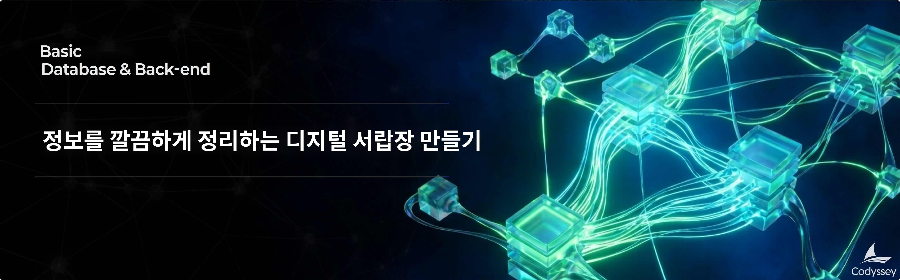

# B5-1: 정보를 깔끔하게 정리하는 디지털 서랍장 만들기

## 📋 과제 정보

| 항목 | 내용 |
|------|------|
| **과목** | 데이터베이스와 백엔드 (Database & Back-end) |
| **난이도** | ★☆☆ (Lv.1) |
| **학습 시간** | 40분 |
| **필수 여부** | ✅ 필수 |
| **진행 상태** | 평가전 |
| **과제 번호** | 185012 |

---

## 🎯 미션 설명

---

## 🛠️ 개발 환경

### 6\. 개발 환경

*   로컬에서 실행 가능한 DB를 설치/준비한다. (예: SQLite, MySQL, PostgreSQL, H2 중 택1)
*   DB에 접속해 SQL을 실행할 수 있는 도구를 준비한다. (예: DBeaver, TablePlus, DataGrip, CLI 등)

---

## ⚠️ 제약 사항

### 7\. 제약 사항

*   백엔드 프레임워크 사용 금지: Spring/Django/Express 등으로 API나 화면을 만들지 않는다.
*   DB: 로컬에서 실행 가능한 DB만 사용한다.
*   범위:
    *   뷰(View), 프로시저, 트리거 같은 고급 기능은 사용하지 않는다.
    *   정규화 이론을 과도하게 깊게 파지 않는다. 대신 “관계가 자연스럽고 쿼리가 잘 나오는 구조”를 목표로 한다.
*   제출물:
    *   스키마 생성 SQL 1개 파일
    *   샘플 데이터 INSERT SQL 1개 파일
    *   쿼리 15개 SQL 1개 파일
    *   실행 결과 캡처(이미지 또는 텍스트) 폴더 1개
    *   (선택) ERD 다이어그램 이미지 1개

---

## 📝 결과 예시

### 8\. 결과 예시

아래는 정답이 아니라 참고 예시다. 실제 주제/테이블/쿼리는 달라도 된다.

*   주제: “도서 대여”
    *   테이블 예시: `member`, `book`, `rental`, `category`
    *   관계 예시:
        *   `rental.member_id` → `member.id`
        *   `rental.book_id` → `book.id`
*   쿼리 예시(형태만 참고)
    *   “대여 중인 책 목록”
    *   “회원별 대여 횟수 집계”
    *   “최근 30일 대여 기록”
    *   “연체 상태로 업데이트”
    *   “대여 기록이 없는 회원 찾기(서브쿼리)”

---

## 📊 평가 정보

- 평가 대상: 예

---

> *이 문서는 Codyssey AI/SW 기초 과정의 과제 내용을 기반으로 자동 생성되었습니다.*
