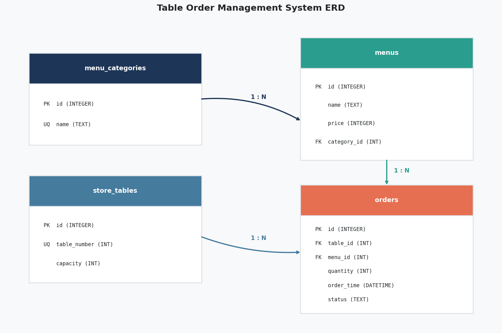
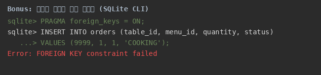

# B5-1: 미션 정보를 깔끔하게 정리하는 디지털 서랍장 만들기

순수 SQL로 만든 **스마트 테이블 오더 SQLite 데이터베이스**다. 도메인 선택, ERD, DDL, seed, 핵심 SQL 15개, 무결성 실험, 보너스 분석, 실행 증거를 한 저장소에서 재현한다.

## 과제 정보

| 항목 | 내용 |
|---|---|
| 분야 | AI/SW 기초 |
| 구분 | 데이터베이스와 백엔드 |
| 공식 학습 시간 | 40시간 |
| DBMS | SQLite 3 |
| 핵심 테이블 | 4개 |
| 핵심 SQL | 15개 |
| 보너스 SQL | 5개 |
| 제한 | 백엔드 프레임워크·View·프로시저·트리거 미사용 |

## 학습 목표

1. 테이블, 행, 열, PK, FK를 설명한다.
2. ERD를 보고 SQLite DDL을 작성한다.
3. NOT NULL·UNIQUE·FK·CHECK로 잘못된 데이터를 막는다.
4. 기본 조회, JOIN, GROUP BY, 서브쿼리, UPDATE, DELETE, 인덱스를 실행한다.
5. 설명이 아니라 실제 실행 결과로 구현을 검증한다.

## 데이터 모델

| 테이블 | 역할 | seed 행 수 |
|---|---|---:|
| `menu_categories` | 메뉴 카테고리 | 10 |
| `store_tables` | 매장 좌석과 수용 인원 | 12 |
| `menus` | 메뉴명·가격·카테고리 | 16 |
| `orders` | 좌석별 주문 항목·수량·상태·시각 | 25 |

관계는 모두 1:N이다.

- `menu_categories → menus`
- `store_tables → orders`
- `menus → orders`



상세 설계: [`architecture_design.md`](architecture_design.md)

## 파일 구성

```text
.
├── 1_schema.sql                 # 4개 테이블과 제약조건
├── 2_data.sql                   # 10/12/16/25행 seed
├── 3_queries.sql                # 핵심 Query 1~15
├── 4_bonus_queries.sql          # 동치 비교 2개 + KPI 3개
├── QUEST.md                     # 공식 PDF 기준 요구사항 정리
├── architecture_design.md       # 데이터 모델·스키마 설명
├── bonus_report.md              # 보너스 SQL과 실제 결과 분석
├── erd_diagram.png              # 현재 스키마 ERD
├── requirements-dev.txt         # 증거 이미지 생성 의존성
├── docs/
│   ├── complex-query-analysis.md
│   ├── development-log.md
│   ├── learning-journal.md
│   ├── decision-log.md
│   ├── issue-handling-log.md
│   └── peer-evaluation-request.md
├── scripts/
│   ├── verify_project.py
│   ├── generate_screenshots.py
│   ├── generate_erd.py
│   └── check_all.sh
└── evidence/
    ├── query_01_result.txt ~ query_15_result.txt
    ├── bonus_01_compare_methods.txt
    ├── bonus_02_fk_error_test.txt
    ├── bonus_03_kpi_metrics.txt
    ├── verification_summary.txt
    └── screenshots/
        ├── query_01.png ~ query_15.png
        └── bonus_fk_error.png
```

## 가장 빠른 검증

Python 3만 있으면 핵심 검증을 실행할 수 있다.

```bash
python scripts/verify_project.py
```

성공 시 마지막에 다음 문구가 나온다.

```text
B5-1 AUTOMATED VERIFICATION: ALL PASS
```

이미지와 ERD까지 모두 다시 만들려면 Pillow를 설치하고 전체 검사를 실행한다.

```bash
python -m pip install -r requirements-dev.txt
scripts/check_all.sh
```

`check_all.sh`는 새 DB 검증 → 결과 이미지 → ERD → `git diff --check` 순서로 실행한다.

## SQLite CLI로 수동 실행

항상 새 DB에서 파일명 순서대로 실행한다.

```bash
rm -f table_order.db
sqlite3 table_order.db < 1_schema.sql
sqlite3 table_order.db < 2_data.sql
sqlite3 -header -column table_order.db < 3_queries.sql
sqlite3 -header -column table_order.db < 4_bonus_queries.sql
```

주의:

- `PRAGMA foreign_keys = ON`은 **SQLite 연결마다** 켜야 한다.
- SQLite에는 별도 DATETIME 저장 클래스가 없다. 이 프로젝트는 `order_time`에 `YYYY-MM-DD HH:MM:SS` 문자열을 일관되게 넣는다.
- `3_queries.sql`에는 UPDATE와 DELETE가 있으므로 실행 전 DB를 새로 만드는 것이 재현에 안전하다.

## 핵심 Query 15개

| 번호 | 범주 | 질문 | 결과 증거 |
|---:|---|---|---|
| 1 | 기본 조회 | 20,000원 이상 메뉴 상위 5개 | [`txt`](evidence/query_01_result.txt) · [`png`](evidence/screenshots/query_01.png) |
| 2 | 기본 조회 | 이름에 전골 또는 철판이 있는 메뉴 | [`txt`](evidence/query_02_result.txt) · [`png`](evidence/screenshots/query_02.png) |
| 3 | 기본 조회 | 현재 COOKING 주문 | [`txt`](evidence/query_03_result.txt) · [`png`](evidence/screenshots/query_03.png) |
| 4 | 기본 조회 | 6명 이상 좌석 | [`txt`](evidence/query_04_result.txt) · [`png`](evidence/screenshots/query_04.png) |
| 5 | INNER JOIN | 취소 제외 주문과 좌석·메뉴 | [`txt`](evidence/query_05_result.txt) · [`png`](evidence/screenshots/query_05.png) |
| 6 | INNER JOIN | 주류 카테고리 3종 메뉴 | [`txt`](evidence/query_06_result.txt) · [`png`](evidence/screenshots/query_06.png) |
| 7 | LEFT JOIN | 주문 이력이 없는 메뉴 | [`txt`](evidence/query_07_result.txt) · [`png`](evidence/screenshots/query_07.png) |
| 8 | LEFT JOIN | 주문 이력이 없는 좌석 | [`txt`](evidence/query_08_result.txt) · [`png`](evidence/screenshots/query_08.png) |
| 9 | 집계 | 카테고리별 메뉴 수·평균 단가 | [`txt`](evidence/query_09_result.txt) · [`png`](evidence/screenshots/query_09.png) |
| 10 | 집계 | 좌석별 취소 제외 주문 금액 | [`txt`](evidence/query_10_result.txt) · [`png`](evidence/screenshots/query_10.png) |
| 11 | 집계 | SERVED 판매 수량 3개 이상 메뉴 | [`txt`](evidence/query_11_result.txt) · [`png`](evidence/screenshots/query_11.png) |
| 12 | 서브쿼리 | 최고가와 같은 메뉴의 주문 | [`txt`](evidence/query_12_result.txt) · [`png`](evidence/screenshots/query_12.png) |
| 13 | 수정 | COOKING인 18번 주문만 SERVED 변경 | [`txt`](evidence/query_13_result.txt) · [`png`](evidence/screenshots/query_13.png) |
| 14 | 삭제 | CANCELLED인 25번 주문만 삭제 | [`txt`](evidence/query_14_result.txt) · [`png`](evidence/screenshots/query_14.png) |
| 15 | 인덱스 | `orders(status)` 후보 인덱스 생성 | [`txt`](evidence/query_15_result.txt) · [`png`](evidence/screenshots/query_15.png) |

Query 13과 14는 ID만 확인하지 않고 예상 현재 상태도 함께 확인한다.

```sql
WHERE id = 18 AND status = 'COOKING'
WHERE id = 25 AND status = 'CANCELLED'
```

## 무결성 규칙과 실증

| 규칙 | 막는 잘못된 입력 | 자동 검증 결과 |
|---|---|---|
| PK | 중복 ID | PASS |
| NOT NULL | 필수값 누락 | 스키마 검사 PASS |
| UNIQUE | 중복 카테고리명·좌석 번호 | 중복 좌석 번호 차단 PASS |
| FK 3개 | 없는 카테고리·좌석·메뉴 참조 | 없는 좌석 참조 차단 PASS |
| CHECK | 음수 가격·좌석 번호·수용 인원·수량 | 음수 수량 차단 PASS |
| CHECK | COOKING/SERVED/CANCELLED 외 상태 | 잘못된 상태 차단 PASS |



## 보너스 결과

1. **JOIN과 서브쿼리 비교**: 같은 질문을 두 방식으로 실행하고 5개 행의 값까지 비교해 집합 동치 PASS
2. **무결성 깨뜨리기**: FK·CHECK·UNIQUE 위반이 실제로 차단되는지 확인
3. **KPI 3종**:
   - 카테고리별 매출 비중 10행
   - 좌석 수용 인원별 물리 테이블당 평균 매출 4행
   - 주방 혼잡도 20.8%

`EXPLAIN QUERY PLAN`은 현재 seed와 SQLite 실행 계획만 설명한다. 특정 방식이 언제나 더 빠르다고 단정하지 않는다.

상세 결과: [`bonus_report.md`](bonus_report.md)

## 컬럼 타입을 이렇게 고른 이유

| 값 | SQLite 선언 | 이유 |
|---|---|---|
| ID·가격·수량·수용 인원 | INTEGER | 원화와 개수는 정수로 계산 |
| 이름·상태 | TEXT | 사람이 읽는 문자열 |
| 주문 시각 | DATETIME 선언 | ISO 형식 문자열을 일관되게 저장하기 위한 의도 표시 |

SQLite의 타입 선언은 다른 DBMS보다 유연하므로, 올바른 값 범위는 CHECK와 일관된 입력 형식으로 보완한다.

## INNER JOIN과 LEFT JOIN

- `INNER JOIN`: 양쪽에 연결되는 행만 반환한다. Query 5·6에서 사용한다.
- `LEFT JOIN`: 왼쪽 행은 모두 남기고 오른쪽에 연결이 없으면 NULL로 둔다. Query 7·8에서 `WHERE 오른쪽.id IS NULL`과 함께 미매칭 행을 찾는다.

현재 seed에서:

- Query 7: 미주문 메뉴 `유자차` 1개
- Query 8: 미주문 좌석 2번, 11번, 12번 3개

## 정규화와 PK/FK

- 카테고리명은 `menu_categories` 한 곳에 저장한다.
- 좌석 정보는 `store_tables` 한 곳에 저장한다.
- 주문에는 메뉴명·좌석 번호를 복사하지 않고 FK를 저장한다.
- PK는 한 행의 고유한 신분증이고, FK는 다른 테이블 행을 가리키는 연결 번호다.

이 구조는 중복 수정을 줄이고 존재하지 않는 부모를 참조하는 실수를 막는다.

## 검증된 현재 결과

- 테이블: 4개
- seed: 10/12/16/25행
- PK: 모든 테이블 PASS
- FK: 3개, 1:N 관계 3개 PASS
- 핵심 SQL: 15개 모두 실행 PASS
- 보너스 SQL: 5개 모두 실행 PASS
- 자동 검증: `B5-1 AUTOMATED VERIFICATION: ALL PASS`

검증 요약 원본: [`evidence/verification_summary.txt`](evidence/verification_summary.txt)

## 학습·선택·문제 기록

- 복합 쿼리 학습: [`docs/complex-query-analysis.md`](docs/complex-query-analysis.md)
- 개발·트러블슈팅: [`docs/development-log.md`](docs/development-log.md)
- 단계별 학습 일지: [`docs/learning-journal.md`](docs/learning-journal.md)
- 선택지와 트레이드오프: [`docs/decision-log.md`](docs/decision-log.md)
- GitHub Issue 처리: [`docs/issue-handling-log.md`](docs/issue-handling-log.md)
- Git 이메일 rewrite 기록: [`docs/history-rewrite.md`](docs/history-rewrite.md)
- old→new commit SHA 전체 매핑: [`docs/email-rewrite-map.tsv`](docs/email-rewrite-map.tsv)
- 감사 지적 최종 처리: [`docs/final-audit-verification.md`](docs/final-audit-verification.md)
- 외부 동료평가 요청서: [`docs/peer-evaluation-request.md`](docs/peer-evaluation-request.md)

외부 동료평가 결과는 평가자가 직접 검증한 뒤 기록한다. 구현자가 실제 평가를 받은 것처럼 임의 작성하지 않는다.
