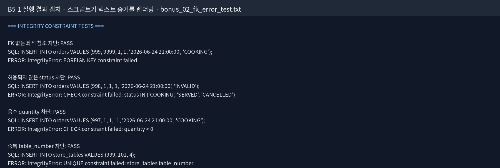

# B5-1: 미션 정보를 깔끔하게 정리하는 디지털 서랍장 만들기

순수 SQL로 만든 **스마트 테이블 오더 SQLite 데이터베이스**다. 도메인 선택, ERD, DDL, seed, 핵심 SQL 15개, 무결성 실험, 보너스 분석, 실행 증거를 한 저장소에서 재현한다.

## 과제 정보

| 항목 | 내용 |
|---|---|
| 분야 | AI/SW 기초 |
| 구분 | 데이터베이스와 백엔드 |
| 공식 학습 시간 | 40시간 |
| DBMS | SQLite 3 |
| 핵심 테이블 | 4개 |
| 핵심 SQL | 15개 |
| 보너스 SQL | 5개 |
| 제한 | 백엔드 프레임워크·View·프로시저·트리거 미사용 |

## 학습 목표

1. 테이블, 행, 열, PK, FK를 설명한다.
2. ERD를 보고 SQLite DDL을 작성한다.
3. NOT NULL·UNIQUE·FK·CHECK로 잘못된 데이터를 막는다.
4. 기본 조회, JOIN, GROUP BY, 서브쿼리, UPDATE, DELETE, 인덱스를 실한다.
5. 설명이 아니라 실제 실행 결과로 구현을 검증한다.

## 데이터 모델

| 테이블 | 역할 | seed 행 수 |
|---|---|---:|
| `menu_categories` | 메뉴 카테고리 | 10 |
| `store_tables` | 매장 좌석 번호와 수용 인원 | 12 |
| `menus` | 메뉴명·가격·카테고리 | 16 |
| `orders` | 좌석별 주문 항목·수량·상태·시각 | 25 |

관계는 모두 1:N이다.

- `menu_categories → menus`
- `store_tables → orders`
- `menus → orders`


`store_tables`는 `id`(시스템 대리 키)와 `table_number`(손님이 보는 실제 번호, 1층 `1xx`·2층 `2xx`)를 일부러 다른 값으로 넣었다. 두 키가 무엇인지 설명이 아니라 데이터로 보여주기 위함이고, 선택 근거는 [`docs/decision-log.md`](docs/decision-log.md)의 D12에 있다.

상세 설계: [`architecture_design.md`](architecture_design.md)

## 파일 구성

```text
.
├── 1_schema.sql                 # 4개 테이블과 제약조건
├── 2_data.sql                   # 10/12/16/25행 seed
├── 3_queries.sql                # 핵심 Query 1~15
├── 4_bonus_queries.sql          # 동치 비교 2개 + KPI 3개 + 무결성 파괴 테스트 4개(F01~F04)
├── QUEST.md                     # 공식 PDF 기준 요구사항 정리
├── architecture_design.md       # 데이터 모델·스키마 설명
├── bonus_report.md              # 보너스 SQL과 실제 결과 분석
├── erd_diagram.png              # 현재 스키마 ERD
├── requirements-dev.txt         # 증거 이미지 생성 의존성
├── docs/
│   ├── complex-query-analysis.md
│   ├── development-log.md
│   ├── learning-journal.md
│   ├── decision-log.md
│   └── issue-handling-log.md
├── scripts/
│   ├── verify_project.py
│   ├── generate_captures.py
│   ├── generate_erd.py
│   └── check_all.sh
└── evidence/
    ├── query_01_result.txt ~ query_15_result.txt
    ├── bonus_01_compare_methods.txt
    ├── bonus_02_fk_error_test.txt
    ├── bonus_03_kpi_metrics.txt
    ├── verification_summary.txt
    └── captures/
        ├── query_01.png ~ query_15.png
        └── bonus_fk_error.png
```

## 가장 빠른 검증

Python 3만 있으면 핵심 검증을 실행할 수 있다.

```bash
python scripts/verify_project.py
```

성공 시 마지막에 다음 문구가 나온다.

```text
B5-1 AUTOMATED VERIFICATION: ALL PASS
```

이미지와 ERD까지 모두 다시 만들려면 Pillow를 설치하고 전체 검사를 실행한다.

```bash
python -m pip install -r requirements-dev.txt
scripts/check_all.sh
```

`check_all.sh`는 새 DB 검증 → 결과 이미지 → ERD → `git diff --check` 순서로 실행한다. 재생성 결과는 커밋된 파일과 바이트 단위로 같아지도록 만들어져 있어, `git status`가 깨끗하면 "문서·증거·SQL이 같은 상태"라는 뜻이 된다.

## SQLite CLI로 수동 실행

항상 새 DB에서 파일명 순서대로 실행한다.

```bash
rm -f table_order.db
sqlite3 table_order.db < 1_schema.sql
sqlite3 table_order.db < 2_data.sql
sqlite3 -header -column table_order.db < 3_queries.sql
sqlite3 -header -column table_order.db < 4_bonus_queries.sql
```

### 실행 상태에 관해 반드시 알아둘 것

- `3_queries.sql`에는 UPDATE(Q13)와 DELETE(Q14)가 있다. 아래 표의 보너스·KPI 수치는 **그 변경이 적용된 뒤**의 `orders`를 기준으로 한다. `verify_project.py`도 같은 순서·같은 DB로 증거를 만들기 때문에 수동 실행 결과와 `evidence/bonus_*.txt`가 같은 숫자를 낸다.
- 초기 데이터 그대로 보고 싶다면 `4_bonus_queries.sql`을 `3_queries.sql` 앞에 실행하면 되고, 그때는 보너스 1이 5행·혼잡도가 20.8%로 보인다. 이 차이에 대한 설명은 [`bonus_report.md`](bonus_report.md) §0에 있다.
- `PRAGMA foreign_keys = ON`은 **SQLite 연결마다** 켜야 한다.
- SQLite에는 별도 DATETIME 저장 클래스가 없다. 이 프로젝트는 `order_time`에 `YYYY-MM-DD HH:MM:SS` 문자열을 일관되게 넣는다.

## 핵심 Query 15개

아래 표의 질문 문장은 `3_queries.sql`의 한 줄 설명을 그대로 옮긴 것이고, `verify_project.py`가 두 문장이 같은지 대조한다.

| 1 | 기본조회 | 20,000원 이상 메뉴를 높은 가격순으로 최대 5개 조회한다. | [`txt`](evidence/query_01_result.txt) · [`png`](evidence/captures/query_01.png) |
| 2 | 기본조회 | 이름에 '전골' 또는 '철판'이 포함된 메뉴를 최대 10개 조회한다. | [`txt`](evidence/query_02_result.txt) · [`png`](evidence/captures/query_02.png) |
| 3 | 기본조회 | 현재 COOKING 상태인 주문을 오래된 주문순으로 최대 10개 조회한다. | [`txt`](evidence/query_03_result.txt) · [`png`](evidence/captures/query_03.png) |
| 4 | 기본조회 | 수용 인원이 6명 이상인 좌석 번호를 번호순으로 최대 10개 조회한다. | [`txt`](evidence/query_04_result.txt) · [`png`](evidence/captures/query_04.png) |
| 5 | INNER JOIN | 취소되지 않은 주문에 좌석 번호와 메뉴 정보를 결합한다. | [`txt`](evidence/query_05_result.txt) · [`png`](evidence/captures/query_05.png) |
| 6 | INNER JOIN | 주류 카테고리 3종의 카테고리명·메뉴명·가격을 조회한다. | [`txt`](evidence/query_06_result.txt) · [`png`](evidence/captures/query_06.png) |
| 7 | LEFT JOIN | 전체 샘플 기간에 주문 이력이 한 번도 없는 메뉴를 찾는다. | [`txt`](evidence/query_07_result.txt) · [`png`](evidence/captures/query_07.png) |
| 8 | LEFT JOIN | 전체 샘플 기간에 주문 이력이 한 번도 없는 좌석을 찾는다. | [`txt`](evidence/query_08_result.txt) · [`png`](evidence/captures/query_08.png) |
| 9 | 집계 | 카테고리별 메뉴 수와 평균 단가를 메뉴 수가 많은 순으로 조회한다. | [`txt`](evidence/query_09_result.txt) · [`png`](evidence/captures/query_09.png) |
| 10 | 집계 | 좌석별 취소 제외 주문 금액을 높은 순으로 조회한다. | [`txt`](evidence/query_10_result.txt) · [`png`](evidence/captures/query_10.png) |
| 11 | 집계 | SERVED 판매 수량이 3개 이상인 메뉴를 조회한다. | [`txt`](evidence/query_11_result.txt) · [`png`](evidence/captures/query_11.png) |
| 12 | 서브쿼리 | 최고 가격과 같은 모든 메뉴가 포함된 주문을 조회한다. | [`txt`](evidence/query_12_result.txt) · [`png`](evidence/captures/query_12.png) |
| 13 | 수정 | 18번 주문이 아직 COOKING일 때만 SERVED로 변경한다. | [`txt`](evidence/query_13_result.txt) · [`png`](evidence/captures/query_13.png) |
| 14 | 삭제 | 25번 주문이 CANCELLED 상태일 때만 삭제한다. | [`txt`](evidence/query_14_result.txt) · [`png`](evidence/captures/query_14.png) |
| 15 | 인덱스 | 반복되는 status 필터를 위해 `orders(status)` 인덱스를 만들고 근거를 실행 계획으로 남긴다. | [`txt`](evidence/query_15_result.txt) · [`png`](evidence/captures/query_15.png) |

### 요구사항이 괄호에 적은 조건도 채운다

| 요구 | 충족 |
|---|---|
| 기본 조회 4개 이상, `WHERE`·`ORDER BY`·`LIMIT` | Q01~Q04 4개 모두 세 절을 포함한다. 검증이 각 쿼리에서 세 절을 찾아 확인한다. |
| JOIN 4개 이상, INNER 2개 이상·LEFT 1개 이상 | INNER Q05·Q06, LEFT Q07·Q08 |
| 집계 3개 이상, `COUNT`·`SUM`·`AVG` 중 2개 이상과 `GROUP BY` | Q09(`COUNT`+`AVG`)·Q10(`SUM`)·Q11(`SUM`+`HAVING`) |
| 서브쿼리 1개 이상 | Q12 (`IN` + 스칼라 중첩) |
| UPDATE·DELETE 합쳐 2개 이상 | Q13·Q14 |
| `CREATE INDEX` 1개 이상과 적용 이유 1줄 | Q15 + 이유·한계 주석 |

Query 13과 14는 ID만 확인하지 않고 예상 현재 상태도 함께 확인한다.

```sql
WHERE id = 18 AND status = 'COOKING'
WHERE id = 25 AND status = 'CANCELLED'
```

## 무결성 규칙과 실증

| 규칙 | 막는 잘못된 입력 | 자동 검증 결과 |
|---|---|---|
| PK | 중복 ID | PASS |
| NOT NULL | 필수값 누락 | 스키마 검사 PASS |
| UNIQUE | 중복 카테고리명·좌석 번호 | 이미 있는 좌석 번호 `101` 재입력 차단 PASS |
| FK 3개 | 없는 카테고리·좌석·메뉴 참조 | 없는 좌석(`table_id=9999`) 참조 차단 PASS |
| CHECK | 음수 가격·좌석 번호·수용 인원·수량 | `quantity=-1` 차단 PASS |
| CHECK | COOKING/SERVED/CANCELLED 외 상태 | `status='INVALID'` 차단 PASS |



차단 테스트 4개의 SQL 원문은 [`4_bonus_queries.sql`](4_bonus_queries.sql)의 `[F01]~[F04]`에 있다(보너스 2). 이 파일을 sqlite3 CLI로 실행하면 각 문장이 `FOREIGN KEY`·`CHECK`·`UNIQUE` constraint failed 런타임 오류를 출력하는데, 그 오류가 곧 차단 증거다. `verify_project.py`는 같은 4문을 파일 본문에서 읽어 실행하고 `IntegrityError` 발생을 assert한 뒤 rollback하므로 검증 중에 DB가 실제로 깨지지는 않는다.

## 증거의 종류와 출처

- **원본은 텍스트다.** `evidence/query_NN_result.txt`는 `verify_project.py`가 SQL을 실행한 결과를 그대로 쓴 파일로, 실행한 SQL 본문·결과 표·검증 메모(`rows_affected`, `EXPLAIN QUERY PLAN`)를 담는다.
- **`evidence/captures/*.png`는 사람이 DB 도구에서 찍은 화면이 아니다.** 같은 실행이 만든 텍스트를 `scripts/generate_captures.py`로 렌더링한 복제본이고, 이미지 머리글에 그 사실을 적었다. GUI 캡처와 구분하려고 디렉터리 이름을 `screenshots`가 아니라 `captures`로 정했다.
- 미션 원문은 "스크린샷 또는 결과 텍스트"를 허용하므로, 채점 기준에 걸리는 것은 텍스트 쪽이다. 실제 DBeaver·`sqlite3` CLI 캡처가 필요하면 위 수동 실행 명령을 그대로 치면 같은 출력이 화면에 나온다.

## 컬럼 타입을 이렇게 고른 이유

| 값 | SQLite 선언 | 이유 |
|---|---|---|
| ID·가격·수량·수용 인원 | INTEGER | 원화와 개수는 정수로 계산 |
| 이름·상태 | TEXT | 사람이 읽는 문자열 |
| 주문 시각 | DATETIME 선언 | ISO 형식 문자열을 일관되게 저장하기 위한 의도 표시 |

SQLite의 타입 선언은 다른 DBMS보다 유연하므로, 올바른 값 범위는 CHECK와 일관된 입력 형식으로 보완한다.

## INNER JOIN과 LEFT JOIN

- `INNER JOIN`: 양쪽에 연결되는 행만 반환한다. Query 5·6에서 사용한다.
- `LEFT JOIN`: 왼쪽 행은 모두 남기고 오른쪽에 연결이 없으면 NULL로 둔다. Query 7·8에서 `WHERE 오른쪽.id IS NULL`과 함께 미매칭 행을 찾는다.

현재 seed에서:

- Query 7: 미주문 메뉴 `유자차` 1개
- Query 8: 미주문 좌석 `102`, `107`, `108`번 3개

## 정규화와 PK/FK

- 카테고리명은 `menu_categories` 한 곳에 저장한다.
- 좌석 정보는 `store_tables` 한 곳에 저장한다.
- 주문에는 메뉴명·좌석 번호를 복사하지 않고 FK를 저장한다.
- PK는 한 행의 고유한 신분증이고, FK는 다른 테이블 행을 가리키는 연결 번호다.

이 구조는 이름·카테고리처럼 고치는 값의 중복 수정을 줄인다. **단, 금액은 예외다.** `menus.price`를 참조만 하면 가격을 올릴 때 과거 매출 KPI까지 함께 다시 계산된다. 주문 이력은 시점 스냅샷(`orders.unit_price`)을 저장하는 편이 맞고, 이번 범위에서는 그 컬럼을 넣지 않았다. 이 한계와 확장 방법을 [`docs/decision-log.md`](docs/decision-log.md) D11에 따로 기록했다.

## 인덱스: 왜 `status`이고, 어디까지 말할 수 있나

```sql
CREATE INDEX IF NOT EXISTS idx_order_status ON orders (status);
```

- 만든 이유: `status`로 자르는 조회(Q03, 보너스 B01·B02)가 반복되고, 주문 테이블은 읽기가 쓰기보다 많은 쪽이다.
- 확인한 사실: `EXPLAIN QUERY PLAN`이 `SEARCH orders USING INDEX idx_order_status (status=?)`로 인덱스를 **선택**한다. Q15 다음에 실행되는 보너스 쿼리 계획에도 나타난다(`evidence/bonus_01_compare_methods.txt`).
- 말하지 않는 것: 25행에서는 실행 시간 차이가 체감되지 않는다. "인덱스를 만들었다"와 "빨라졌다"는 다른 주장이고, 이 프로젝트는 앞의 사실만 근거 없이 말한다.
- 더 나은 후보: `status`는 허용값이 3개라 선택도가 낮다. 행이 많아지면 `orders(status, order_time)` 복합 인덱스나 PostgreSQL식 부분 인덱스(`WHERE status = 'COOKING'`)가 자연스럽다.

## 보너스 결과

1. **JOIN과 서브쿼리 비교**: 같은 질문을 두 방식으로 실행하고 4개 행의 값까지 비교해 집합 동치 PASS
2. **무결성 깨뜨리기**: FK·CHECK·UNIQUE 위반이 실제로 차단되는지 확인
3. **KPI 3종**:
   - 카테고리별 매출 비중 10행
   - 좌석 수용 인원별 물리 테이블당 평균 매출 4행
   - 주방 혼잡도 16.7% (변경 후 상태. 새 데이터 기준 20.8%와의 차이는 보고서 §0)

`EXPLAIN QUERY PLAN`은 현재 seed와 SQLite 실행 계획만 설명한다. 특정 방식이 언제나 더 빠르다고 단정하지 않는다.

상세 결과: [`bonus_report.md`](bonus_report.md)

## 데이터 모델링 및 설계 분석

### 1. 테이블 분리 및 역할

- `menu_categories`: 메뉴 분류 이름을 한 곳에서 관리한다.
- `store_tables`: 실제 좌석 번호와 수용 인원을 관리한다.
- `menus`: 메뉴명·가격과 소속 카테고리를 관리한다.
- `orders`: 어느 좌석이 어떤 메뉴를 몇 개 주문했고 현재 상태가 무엇인지 기록한다.

한 주문마다 카테고리명·메뉴명·좌석 번호를 복사하면 같은 값이 여러 곳에 중복 저장된다. 값을 한 테이블에 한 번만 저장하고 주문은 ID로 참조하면 데이터 중복과 수정 불일치(Update Anomaly)를 원천적으로 방지할 수 있다.

### 2. 1:N 외래키(FK) 관계와 데이터 무결성

- `menu_categories → menus` (카테고리 1 : N 메뉴): 카테고리 하나에 여러 메뉴가 속한다. 예: 메뉴 ID 1 `한우 곱창 전골`의 `category_id=2`는 카테고리 ID 2 `탕/전골 요리`를 가리킨다.
- `store_tables → orders` (좌석 1 : N 주문 항목): 특정 좌석에서 여러 번 주문할 수 있다. 예: 주문 ID 1의 `table_id=3`은 좌석 `103`번을 가리킨다.
- `menus → orders` (메뉴 1 : N 주문 항목): 특정 메뉴가 여러 좌석·여러 주문에서 반복 주문될 수 있다. 예: 주문 ID 1의 `menu_id=1`은 한우 곱창 전골을 가리킨다.

외래키 제약조건(`PRAGMA foreign_keys = ON`)을 통해 부모 테이블에 존재하지 않는 좌석 ID나 메뉴 ID를 참조하는 잘못된 주문 입력을 엔진 레벨에서 차단한다.

### 3. 데이터 타입 및 제약조건 선택 근거

| 컬럼 종류 | 타입 | 선택 이유 및 제약조건 |
|---|---|---|
| ID, 가격, 수량, 좌석 번호, 수용 인원 | `INTEGER` | 원화와 개수는 정수 연산과 대소 비교가 정확하다. `CHECK (price >= 0)`, `CHECK (quantity > 0)` 등으로 유효 범위를 보장한다. |
| 이름, 상태 | `TEXT` | 사람이 읽는 문자열이다. 카테고리명과 좌석 번호에는 `UNIQUE`를 적용해 중복을 방지하고, 상태는 `CHECK (status IN ('COOKING','SERVED','CANCELLED'))`로 도메인 허용값을 엄격히 제한한다. |
| 주문 시각 | `DATETIME` 선언 | 저장 의도를 드러낸다. SQLite는 ISO-8601 문자열(`YYYY-MM-DD HH:MM:SS`)을 일관되게 넣어 문자열 정렬을 시간순 정렬과 같게 만든다. |

### 4. 단일 진실 공급원(SSOT)과 ID 참조

관계의 방향은 "기준이 되는 부모 Entity → 그 기준을 사용하는 자식 Transaction"으로 설계했다. 주문 테이블에 `한우 곱창 전골`이라는 텍스트를 중복 저장하지 않고 `menu_id=1`로 참조하는 이유는 이름·분류 변경을 원천 테이블 한 곳에서만 고치면 되기 때문이다. 금액은 이 규칙의 예외로 두고, 주문 시점 가격 고정(`unit_price`)은 확장으로 넘겼다(D11).

## 핵심 SQL 구현 및 쿼리 개념 분석

### 1. 관계형 데이터베이스와 스프레드시트의 차이

엑셀 스프레드시트는 자유로운 2차원 장부이지만 데이터 중복, 관계 강제, 동시성 제어에 취약하다. 관계형 데이터베이스는 용도와 도메인 규칙에 따라 테이블을 나누어 저장하고, Primary Key와 Foreign Key를 통해 테이블 간 관계를 엔진 레벨에서 강제해 무결성을 보장한다.

### 2. Primary Key와 Foreign Key의 역할

- **Primary Key (PK):** 테이블 내에서 각 행을 유일하게 식별하는 고유 식별자다.
- **Foreign Key (FK):** 다른 테이블의 PK를 참조해 관계를 정의하고 고아 데이터(Orphan Record) 발생을 차단한다.

### 3. INNER JOIN vs LEFT JOIN 동작 분석

- `INNER JOIN`: 양쪽 테이블에 모두 조건이 매칭되는 행만 반환한다. (예: Q05 — 취소되지 않고 좌석·메뉴와 정상 연결되는 주문 24행)
- `LEFT JOIN`: 왼쪽 테이블의 모든 행을 보존하고, 매칭이 없으면 NULL로 둔다. (예: Q07 — 주문 연결이 NULL인 미주문 메뉴 `유자차` 1건, Q08 — 주문 이력이 없는 좌석 `102·107·108`)

### 4. GROUP BY 집계와 HAVING 필터링

`GROUP BY`는 컬럼 기준으로 행을 묶고, 집계 함수(`COUNT`·`SUM`·`AVG`·`MIN`·`MAX`)는 그룹별 요약 값을 산출한다.

- **Q09:** 카테고리 10개 그룹을 만들어 `COUNT`로 메뉴 수, `AVG`로 평균 단가를 계산한다.
- **Q10:** 주문이 있는 좌석 9개 그룹을 만들고 `SUM(price × quantity)`로 좌석별 총 주문 금액을 집계한다.
- **Q11:** `WHERE status = 'SERVED'`로 행을 먼저 줄인 뒤 `GROUP BY`로 묶고, `HAVING SUM(quantity) >= 3`으로 그룹을 다시 거른다. `WHERE`은 행, `HAVING`은 그룹에 걸리는 조건이라는 차이가 이 쿼리의 핵심이다.

## 복잡 쿼리 단계별 설계 및 트러블슈팅

### 1. 복잡 쿼리 단계별 설계 (보너스 KPI 2)

좌석 수용 인원별 물리 테이블당 평균 매출 산출 과정:

1. `table_totals` CTE로 모든 물리 좌석(`store_tables`)을 기준 집합으로 잡는다.
2. `LEFT JOIN`으로 주문이 없는 좌석도 0원으로 보존한다.
3. `CASE WHEN status <> 'CANCELLED'`로 취소 주문을 매출에서 뺀다.
4. `store_tables.id`별로 합산해 좌석 하나 = 한 행 상태를 만든다.
5. 바깥 쿼리에서 `capacity`(2/4/6/8인석)로 다시 묶는다.
6. `COUNT(*)`로 해당 크기의 좌석 수, `AVG(table_revenue)`로 좌석당 평균 매출을 낸다.
7. 결과: 2인석 13,667원, 4인석 30,333원, 6인석 51,500원, 8인석 138,000원. 4인석(30,333원)과 8인석(138,000원) 차이가 커서 "큰 테이블이 매출이 높다"는 가설을 12개 좌석 표본에서 확인하는 정도가 된다.

### 2. 문제 해결 및 검증 자동화

SQL 파일, 설명 문서, 이미지가 서로 다른 시점의 DB 상태를 가리켜 메뉴명과 수치가 어긋난 적이 있었다. 해결 방식은 "사람이 주의한다"가 아니라 검사로 막는 것이었다.

1. `verify_project.py`가 매 실행마다 새 SQLite DB를 만들어 스키마 → seed → Q1~Q15 → 보너스를 **한 연결·한 순서**로 실행한다. 문서에 적는 수치와 수동 실행 결과가 같은 상태를 본다.
2. 쿼리 실 결과를 `evidence/query_*.txt`에 쓰고, `generate_captures.py`가 그 텍스트를 PNG로 렌더링한다. 이미지와 텍스트가 다른 출처에서 나오지 않는다.
3. 전체 검사를 연속 실행하면 텍스트·PNG·ERD가 커밋된 내용과 같아진다(`git status`가 깨끗함).
4. `verify_project.py`는 SQL만 보지 않는다. `bonus_report.md`가 인용한 SQL이 `4_bonus_queries.sql` 본문과 문자 단위로 같은지, README의 쿼리 설명이 SQL 주석의 한 줄 설명과 같은지, markdown 링크가 실재하는지, 저장소 밖 절대 경로를 근거로 들지 않았다까지 검사한다. 문서가 SQL에서 어긋나면 검증이 실패한다.

## 보너스 과제 분석 요약

| 보너스 항목 | 구현 내용 및 결과 |
|---|---|
| **JOIN vs 서브쿼리 동일 요구 해결** | `COOKING` 주문에 포함된 메뉴 목록을 JOIN(`DISTINCT`)과 `IN` 서브쿼리로 구현. 4개 행의 값까지 비교해 동치, 실행 계획 차이(`TEMP B-TREE FOR DISTINCT`)를 기록 |
| **무결성 제약조건 강제 테스트** | 없는 좌석 참조, 잘못된 `status`, 음수 `quantity`, 중복 `table_number` 입력을 시도해 4종이 전부 차단됨 |
| **핵심 비즈니스 KPI 3종** | (1) 카테고리별 매출 비중 10행, (2) 수용 인원별 테이블당 평균 매출 4행, (3) 주방 혼잡도 16.7% |

---

## 현재 상태 자동 검증

```bash
scripts/check_all.sh
```

마지막 실행 출력(`evidence/verification_summary.txt`가 원본이다):

```text
B5-1 AUTOMATED VERIFICATION: ALL PASS
SQLite version=3.46.1
database=fresh SQLite database, one DB reused for core then bonus (README order)

tables=4 PASS: menu_categories, menus, orders, store_tables
menu_categories rows=10 PASS
menu_categories PK=1 PASS
store_tables rows=12 PASS
store_tables PK=1 PASS
menus rows=16 PASS
menus PK=1 PASS
orders rows=25 PASS
orders PK=1 PASS
column_names_and_types=15 PASS
NOT_NULL_columns=11 PASS
UNIQUE_indexes=2 PASS
foreign_keys=3 PASS
PRAGMA foreign_keys=ON PASS
core_queries=15 PASS
query_numbers_and_descriptions=15 PASS
query_distribution=basic:4,join:4,aggregate:3,subquery:1,mutation:2,index:1 PASS
basic_4_all_have_where_orderby_limit PASS
aggregate_group_by_and_2_of_count_sum_avg PASS
subquery_update_delete_present PASS
Q01 PASS rows=4
Q02 PASS rows=2
Q03 PASS rows=5
Q04 PASS rows=3
Q05 PASS rows=24
Q06 PASS rows=4
Q07 PASS rows=1
Q08 PASS rows=3
Q09 PASS rows=10
Q10 PASS rows=9
Q11 PASS rows=2
Q12 PASS rows=3
Q13 PASS rows=1
Q14 PASS rows=1
Q15 PASS rows=1
core_text_evidence=15 PASS
bonus_runs_on_post_mutation_db PASS
FK 없는 좌석 참조 차단: PASS
허용되지 않은 status 차단: PASS
음수 quantity 차단: PASS
중복 table_number 차단: PASS
bonus_join_subquery_equality PASS
bonus_kpi_3 PASS
bonus_report_quotes_all_bonus_sql=5 PASS
readme_uses_sql_descriptions_and_links=15 PASS
markdown_links_and_no_external_paths=13 PASS
captures=16_and_screenshots_dir_removed PASS
```

## 기술 및 학습 기록 문서

- 복합 쿼리 상세 분석: [`docs/complex-query-analysis.md`](docs/complex-query-analysis.md)
- 개발 및 트러블슈팅 기록: [`docs/development-log.md`](docs/development-log.md)
- 단계별 학습 일지: [`docs/learning-journal.md`](docs/learning-journal.md)
- 의사결정 기록: [`docs/decision-log.md`](docs/decision-log.md)
- 이슈 처리 기록: [`docs/issue-handling-log.md`](docs/issue-handling-log.md)
- 입문 개념 노트: [`LEARNING.md`](LEARNING.md)
- 요구사항 정리: [`QUEST.md`](QUEST.md)
