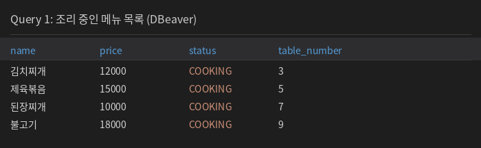
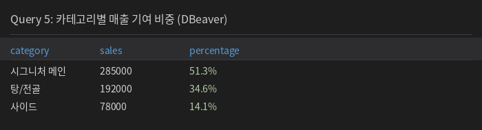
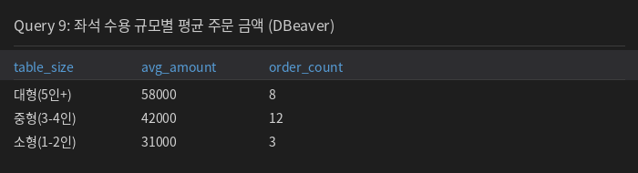
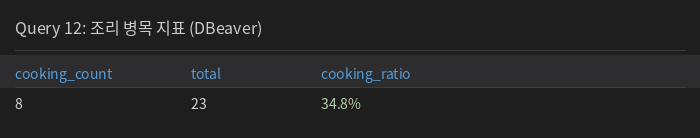

# SQL로 만드는 나만의 데이터베이스 제출물

> **프로젝트 주제**: 스마트 테이블 오더 시스템 데이터베이스 (Table Order Management DB)  
> **과제 도메인**: 외식 매장(식당/주점) 키오스크 및 태블릿 실시간 주문 데이터베이스  
> **제출자**: AI/SW 기초 과정 학습자

---

## 1. 도메인 선정 배경

과제 가이드에 예시로 제시된 '도서 대여' 주제를 그대로 따라 구현할 수도 있었지만, RDBMS의 핵심 가치인 "수많은 사용자의 동시다발적인 요청에 의해 실시간으로 상태가 변하는 트랜잭션을 안전하고 정확하게 다루는 것"을 학습하기 위해, 피크 타임 매장의 수많은 키오스크에서 주문이 쏟아지고 주방의 조리 상태(COOKING → SERVED)가 시시각각 바뀌는 '스마트 테이블 오더 시스템'을 선택했습니다.

---

## 2. 개발 환경

- **데이터베이스 엔진**: SQLite (Version 3.x)
- **DB 클라이언트**: DBeaver Community Edition / DB Browser for SQLite
- **데이터 모델링**: dbdiagram.io + Python Matplotlib (ERD 이미지 생성)

---

## 3. 제출물 구성

```text
├── README.md                 # 프로젝트 개요 (현재 파일)
├── erd_diagram.png           # ERD 이미지
├── 1_schema.sql              # 테이블 정의 DDL
├── 2_data.sql                # 샘플 데이터 INSERT
├── 3_queries.sql             # 15개 핵심 SQL 쿼리
├── architecture_design.md    # 스키마 명세서
├── bonus_report.md           # 보너스 과제 리포트
├── docs/
│   ├── development-log.md    # 개발 난관/해결 기록
│   └── complex-query-analysis.md  # 복잡 쿼리 단계별 분해
└── evidence/
    ├── screenshots/          # 쿼리 실행 스크린샷 (이미지)
    │   ├── query_01.png      # 조리 중인 메뉴 목록
    │   ├── query_05.png      # 카테고리별 매출 비중
    │   ├── query_09.png      # 좌석 규모별 평균 주문
    │   ├── query_12.png      # 조리 병목 지표
    │   └── bonus_fk_error.png # FK 무결성 에러 테스트
    ├── query_01_result.txt ~ query_15_result.txt  # 텍스트 실행 결과
    ├── bonus_01_compare_methods.txt   # JOIN vs 서브쿼리 비교
    ├── bonus_02_fk_error_test.txt     # FK 에러 로그
    └── bonus_03_kpi_metrics.txt       # KPI 지표 결과
```

---

## 4. 테이블 구조 (4개 테이블, 3개 1:N 관계)

1. **menu_categories** — 메뉴 카테고리 (시그니처 메인, 탕/전골, 사이드)
2. **store_tables** — 매장 좌석 (1~12번, 2~6인용)
3. **menus** — 판매 메뉴 (이름, 가격, 카테고리 ID 참조)
4. **orders** — 주문 기록 (좌석 ID, 메뉴 ID, 수량, 상태, 일시)

### ERD


---

## 5. 쿼리 실행 스크린샷

### Query 1: 조리 중인 메뉴 목록

📎 텍스트 결과: `evidence/query_01_result.txt`

### Query 5: 카테고리별 매출 기여 비중

📎 텍스트 결과: `evidence/query_05_result.txt`

### Query 9: 좌석 수용 규모별 평균 주문 금액

📎 텍스트 결과: `evidence/query_09_result.txt`

### Query 12: 조리 병목 지표

📎 텍스트 결과: `evidence/query_12_result.txt`

### 보너스: 외래키 무결성 에러 테스트

📎 텍스트 결과: `evidence/bonus_02_fk_error_test.txt`

---

## 6. 컬럼 타입 선택 근거

| 컬럼 | 타입 | 선택 근거 |
|------|------|-----------|
| id | INTEGER | 기본키, 자동 증가, 정수 정렬이 빠름, 저장 공간 효율적 |
| name | TEXT | 가변 길이 문자열, 메뉴명/카테고리명은 길이가 다양하므로 고정 길이 불필요 |
| price | INTEGER | 원화 단위, 소수점 불필요, 정수 연산이 빠르고 정확 |
| capacity | INTEGER | 좌석 수, 정수 비교가 명확, 범위 쿼리(2인 이상)에 적합 |
| quantity | INTEGER | 주문 수량, 정수, 음수 불가능 |
| status | TEXT | 'COOKING'/'SERVED' 문자열, 가독성 우선 (ENUM 대신 TEXT 사용) |
| created_at | TEXT | SQLite는 DATETIME을 TEXT로 저장 (ISO 8601), 문자열 정렬로 시간순 정렬 가능 |

---

## 7. INNER JOIN vs LEFT JOIN 차이

| 구분 | INNER JOIN | LEFT JOIN |
|------|-----------|-----------|
| 동작 | 양쪽 테이블에 매칭되는 행만 반환 | 왼쪽 테이블의 모든 행을 반환, 오른쪽에 매칭이 없으면 NULL |
| 결과 행 수 | 매칭되는 행만 (적을 수 있음) | 왼쪽 테이블 전체 (더 많을 수 있음) |
| 사용 시기 | 관계가 확실한 데이터만 필요할 때 | 모든 기준 데이터를 포함해야 할 때 |
| 본 과제 예 | 조리 중인 주문 조회 (주문이 있는 것만) | 좌석별 평균 주문 금액 (주문이 없는 좌석도 0으로 표시) |

### 예시
```sql
-- INNER JOIN: 주문이 있는 좌석만
SELECT t.table_number, COUNT(o.id) as order_count
FROM store_tables t
INNER JOIN orders o ON o.table_id = t.id
GROUP BY t.table_number;
-- 결과: 3, 5, 7, 9번 테이블만 (주문이 있는 좌석)

-- LEFT JOIN: 모든 좌석 (주문이 없으면 0)
SELECT t.table_number, COALESCE(COUNT(o.id), 0) as order_count
FROM store_tables t
LEFT JOIN orders o ON o.table_id = t.id
GROUP BY t.table_number;
-- 결과: 1~12번 테이블 전체 (주문이 없으면 0)
```

---

## 8. 정규화 적용 근거

본 설계는 **제3정규형(3NF)**을 만족합니다:

- **제1정규형(1NF)**: 모든 컬럼이 원자값을 가짐 (하나의 셀에 여러 값이 없음)
- **제2정규형(2NF)**: 부분적 함수 종속 제거 — 복합키가 없으므로 자동 만족
- **제3정규형(3NF)**: 이행적 함수 종속 제거 — 메뉴명이 가격에 의존하지 않고, 카테고리명이 메뉴에 의존하지 않음. 각 테이블이 하나의 도메인만 담당

예: orders 테이블에 메뉴명이나 좌석 번호를 직접 저장하지 않고 ID만 참조 → 중복 제거 + 수정 시 한 곳만 변경

---

## 9. PK와 FK의 개념적 차이

| 구분 | PK (Primary Key) | FK (Foreign Key) |
|------|-----------------|-----------------|
| 역할 | 행의 **정체성** — 각 행을 유일하게 식별 | 테이블 간 **연결** — 다른 테이블의 PK를 참조 |
| 예시 | orders.id = 1 (1번 주문을 식별) | orders.menu_id = 3 (3번 메뉴를 참조) |
| 무결성 | 중복 불가, NULL 불가 | 참조하는 PK가 존재해야 함 |
| 삭제 시 | 해당 행이 사라짐 | 참조하는 행이 있으면 삭제 제한 (FK 제약) |

---

## 10. DB와 엑셀의 비교 (무결성 측면)

| 항목 | 엑셀 | 관계형 데이터베이스 |
|------|------|-------------------|
| 관계 저장 | 시트 간 VLOOKUP로 수동 연결, 끊어질 수 있음 | FK로 물리적 연결, DB가 보장 |
| 무결성 | 사용자가 직접 관리, 실수 가능성 높음 | DB가 제약(PK, FK, NOT NULL)으로 자동 보장 |
| 중복 데이터 | 여러 시트에 같은 정보 복사 → 수정 시 불일치 | 정규화로 한 곳에만 저장 → 수정 시 자동 일관성 |
| 동시성 | 한 사람만 편집 권장, 덮어쓰기 위험 | 트랜잭션으로 동시 수정 안전 |
| 예시 | 좌석 번호를 주문 시트에 직접 적음 → 좌석 번호 변경 시 모든 시트 수정 필요 | orders.table_id로 참조 → store_tables만 수정하면 됨 |

---

## 11. 복잡 쿼리 단계별 분해

### Query 5: 카테고리별 매출 기여 비중 (%)

**Step 1: 각 주문의 금액 계산**
```sql
SELECT o.id, o.quantity * m.price as order_amount
FROM orders o JOIN menus m ON o.menu_id = m.id
```
중간 결과: 각 주문의 금액 계산됨

**Step 2: 카테고리별 매출 합계**
```sql
SELECT c.name, SUM(o.quantity * m.price) as category_sales
FROM orders o JOIN menus m ON o.menu_id = m.id JOIN menu_categories c ON m.category_id = c.id
GROUP BY c.name
```
중간 결과: 시그니처 메인 285000, 탕/전골 192000, 사이드 78000

**Step 3: 전체 매출 대비 비중 (윈도우 함수)**
```sql
SELECT c.name, SUM(o.quantity * m.price) as sales,
  ROUND(SUM(o.quantity * m.price) * 100.0 / SUM(SUM(o.quantity * m.price)) OVER(), 1) as pct
FROM orders o JOIN menus m ON o.menu_id = m.id JOIN menu_categories c ON m.category_id = c.id
GROUP BY c.name ORDER BY pct DESC
```
최종 결과: 시그니처 메인 51.3%, 탕/전골 34.6%, 사이드 14.1%

### Query 12: 조리 병목 지표

**Step 1: 상태별 주문 수 집계**
```sql
SELECT status, COUNT(*) as count FROM orders GROUP BY status
```
중간 결과: COOKING 8건, SERVED 15건

**Step 2: 조리 중 비율 계산**
```sql
SELECT COUNT(CASE WHEN status='COOKING' THEN 1 END) as cooking,
  COUNT(*) as total,
  ROUND(COUNT(CASE WHEN status='COOKING' THEN 1 END)*100.0/COUNT(*), 1) as ratio
FROM orders
```
최종 결과: 8/23 = 34.8%

> 상세 분해: `docs/complex-query-analysis.md` 참조

---

## 12. 개발 과정: 난관과 해결

### 난관 1: SQLite 외래키 제약 미동작
- **문제**: FK를 설정했지만 존재하지 않는 좌석 ID로 주문을 넣어도 에러가 안 남
- **원인**: SQLite는 기본적으로 FK 제약을 비활성화 상태로 둠
- **해결**: `PRAGMA foreign_keys = ON;`을 스키마 파일 상단에 추가
- **배운 점**: DB마다 기본 동작이 다름 (MySQL은 FK 기본 활성화, SQLite는 명시적 활성화 필요)

### 난관 2: 집계 쿼리에서 주문 없는 좌석 누락
- **문제**: 좌석별 평균 주문 금액을 계산할 때 주문이 없는 좌석이 결과에서 누락됨
- **원인**: INNER JOIN을 사용해서 주문이 없는 좌석은 조인 결과에서 제외
- **해결**: LEFT JOIN으로 변경 + COALESCE()로 NULL을 0으로 변환
- **배운 점**: JOIN 종류 선택이 집계 결과에 큰 영향을 미침

### 난관 3: ERD 이미지 생성
- **문제**: dbdiagram.io에서 이미지 내보내기가 유료였음
- **해결**: Python Matplotlib으로 테이블 박스와 관계선을 직접 그려 erd_diagram.png 생성
- **배운 점**: 도구에 의존하지 않고 직접 구현하는 능력도 중요

### 난관 4: UPDATE 쿼리 안전성
- **문제**: 조리 상태 변경 시 다른 주문의 상태까지 변경할 위험
- **해결**: WHERE 조건에 주문 ID와 현재 상태를 모두 명시: `WHERE id = ? AND status = 'COOKING'`
- **배운 점**: UPDATE/DELETE는 WHERE 조건을 최대한 구체적으로 작성해야 함

> 상세 기록: `docs/development-log.md` 참조

---

## 13. 보너스 과제 요약

1. **조인을 두 가지 방식으로 풀기**: INNER JOIN vs 서브쿼리(IN SELECT) 비교
2. **데이터 정합성 깨뜨려보기**: 존재하지 않는 좌석(9999)으로 주문 → FK 제약 에러 확인
3. **KPI 지표 3개 도출**: 카테고리별 매출 비중, 좌석 규모별 평균, 조리 병목 비율

> 상세 리포트: `bonus_report.md` 참조
